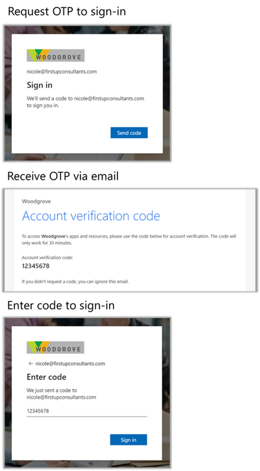
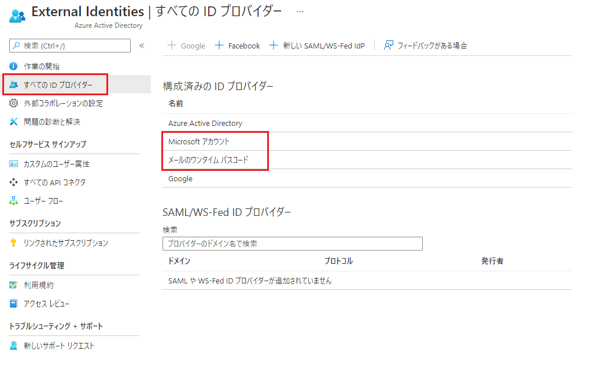

# 外部 ID ユーザー フローをより簡単に設定

こんにちは、Azure Identity サポート チームの 村上 です。本記事は、2021 年 7 月 19 日に米国の Azure Active Directory Identity Blog で公開された [Do more with External Identities user flows in just a few clicks](https://techcommunity.microsoft.com/t5/azure-active-directory-identity/do-more-with-external-identities-user-flows-in-just-a-few-clicks/ba-p/2147076) を意訳したものになります。ご不明点等ございましたらサポート チームまでお問い合わせください。

----

皆さん、こんにちは。
 
弊社では皆様のご意見にお応えして、お客様やパートナーに向けたアプリケーションの ID を、より柔軟に、より早く設定できるよう改善をしております。現在、マイクロソフトは Azure Active Directory のセルフサービス サインアップと次世代の B2C ユーザー フローを改善し、様々な ID を持つユーザーがより簡単にサインイン、サインアップ、コラボレーションできるように取り組んでいます。さらに、B2C アプリの開発者や管理者においては、ユーザー セッションやパスワード リセット設定を簡単に構成できるようになり、さらには外部のデータやサービスに接続することでユーザー体験を拡張することも容易となっています。

## Microsoft アカウントと E メール ワンタイム パスコードによるセルフサービス サインアップ

Ignite (Microsoft が主催するグローバル カンファレンス) 以降、Azure AD のセルフサービス サインアップ機能を利用して、外部ユーザーが自身の ID を使用 (bring their own identity) するための 2 つの方法が追加されました。個人や中小企業において、Windows、Xbox、Skype、その他の Microsoft 365 アプリケーションにサインインするために個人の Microsoft アカウントを使用しているユーザーは、その既存のアカウントを使用して、事前に設定されたアプリケーションにサインアップできるようになりました。

Microsoft アカウントをお持ちでないお客様は、ワンタイム パスコード (OTP) を E メール アドレスへ送信することができます。

Azure ポータルの [すべての ID プロバイダー] ページから、[メールのワンタイム パスコード] と [Microsoft  アカウント] を有効に設定します。また、セルフ サービス サインアップのユーザー フローにおいても、上記の ID プロバイダーを有効にください。

設定の詳細は、[Microsoft アカウント (MSA) ID プロバイダー](https://docs.microsoft.com/ja-jp/azure/active-directory/external-identities/microsoft-account) と [E メールのワンタイム パスコード](https://docs.microsoft.com/ja-jp/azure/active-directory/external-identities/one-time-passcode) をご覧ください。

## B2C アプリ向けパスワード リセットと [サインインしたままにする] を設定するためのビルトイン ユーザー フロー

B2C 向けのビルトイン ユーザー フローにより、アプリ開発者は新しいアプリケーション コードを大量に追加する必要なく、ユーザーのサインアップ、サインイン、パスワードのリセットを設定できます。ビルトイン ユーザー フローは新たに追加された設定項目により、一層使いやすくなりました。アプリ開発者は数回のクリックだけで、[サインインしたままにする] や、より柔軟なパスワード リセットの設定を行うことができるようになりました。
 
 [サインインしたままにする] を有効にすると、永続的なクッキーを使用することで、ユーザーのセッションを長く維持することができます。これにより、ユーザーがブラウザを閉じたり開いたりしても、セッションが有効のまま維持されます。ユーザーが明示的にサインアウトするとセッションは無効になります。また、パスワード リセットを有効にすると、ユーザーがパスワードを忘れたときや、サインイン時に期限切れパスワードのリセットを求められたときに、ユーザー自身がパスワードをリセットすることができます。

.jpg)

## Azure AD B2C 向けの API コネクタ

数ヶ月前のブログですが、API コネクターを利用した Azure AD アプリケーションのサインアップ フローをカスタマイズする方法について、[いくつかの例](https://techcommunity.microsoft.com/t5/azure-active-directory-identity/simple-and-secure-customization-with-b2c-user-flows/ba-p/1751709) をご紹介しました。 外部システムと接続することで、サインアップ ユーザーフローを拡張できるこの機能は GA となっています。

また、レガシーな ID システムやカスタム データ ストア、その他のクラウド サービスから提供される属性を用いて、サインインやサインアップのユーザー フロー用のトークンを拡張することで、ユーザー フローの拡張性を高め、API コネクターをより強力にすることにも取り組んでいます。この機能は、今後数週間以内に Azure AD B2C のプレビューとして公開される予定です。

皆様のご意見をお待ちしております。Azure フォーラムや Twitter で [@AzureAD](http://twitter.com/azuread)をメンションして、新機能に関するフィードバックをお寄せください。
